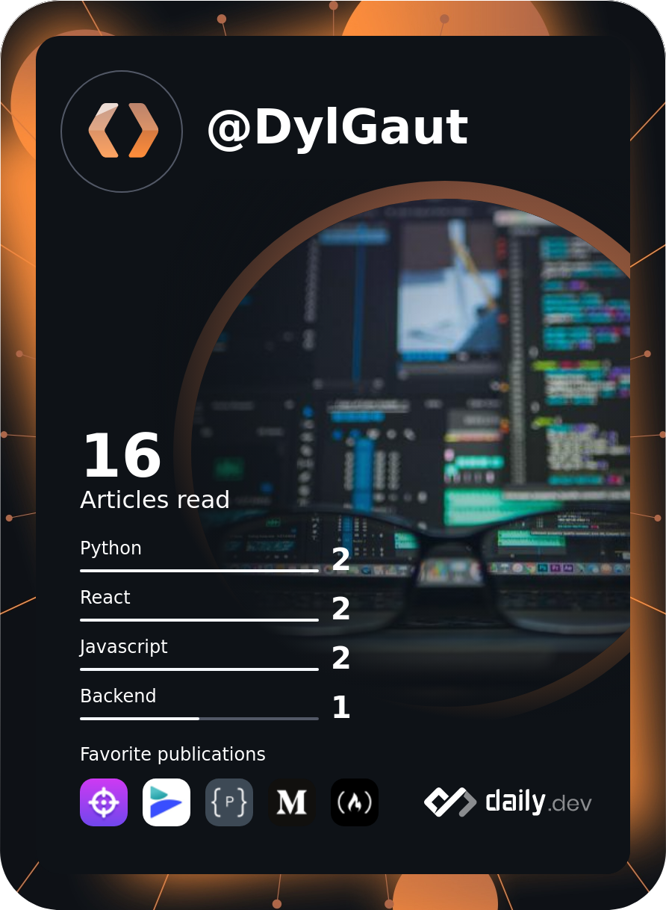

 

<h2 align="center"> Aspiring Cybersecurity Analyst, passionate, and eager to make connections! </h2>
  
  **I'm currently studying for Network+.**  

Methods include:
  - Professor Messer
  - Practice Tests
  - ChatGPT for Tutoring  

🌱 I'm always looking to learn new things.   
💬 Feel free to reach out at anytime and I'll always get back to you :)    

2024 Goals Include:  
- Becoming fluent in Python
- (~~)Obtaining Network +(~~) - Complete!
- Obtaining Security +
- Security & Networking projects

<h2></h2> 

 
   

<!--
**DylGaut/DylGaut** is a ✨ _special_ ✨ repository because its `README.md` (this file) appears on your GitHub profile.

Here are some ideas to get you started:

- 🔭 I’m currently working on ...
- 🌱 I’m currently learning ...
- 👯 I’m looking to collaborate on ...
- 🤔 I’m looking for help with ...
- 💬 Ask me about ...
- 📫 How to reach me: ...
- 😄 Pronouns: ...
- ⚡ Fun fact: ...
-->
